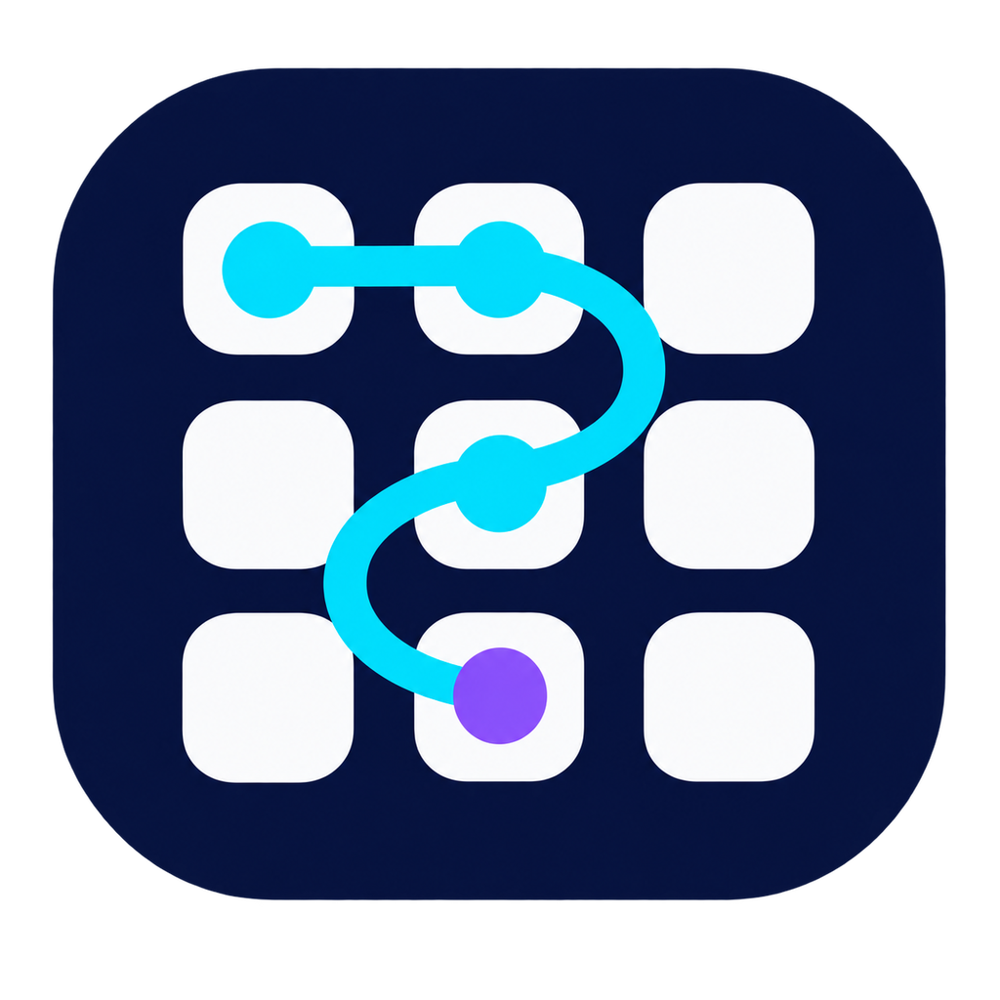
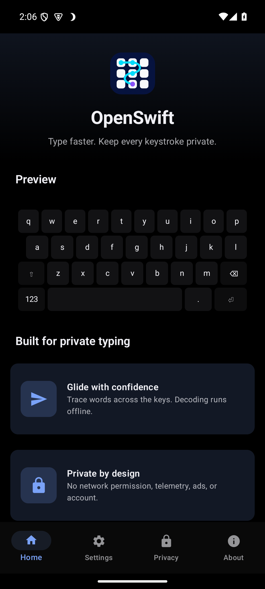
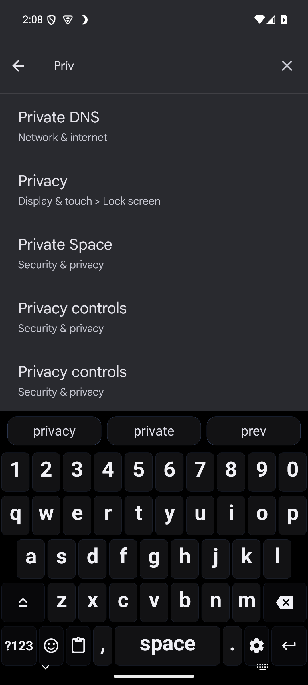
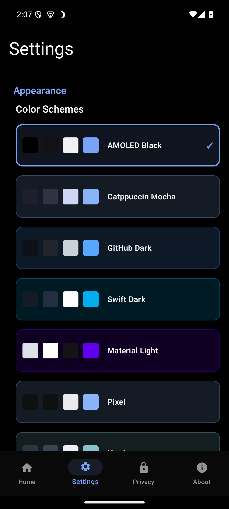
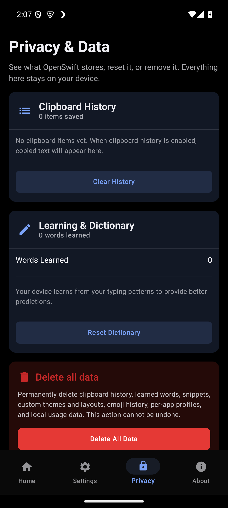

<p align="center">
  
</p>

<h1 align="center">OpenSwift</h1>

<p align="center"><strong>A fast Android keyboard with an offline typing engine and no network permission.</strong></p>

<p align="center">
  <a href="https://github.com/SysAdminDoc/OpenSwift/releases"></a>
  <a href="LICENSE"></a>
  
  
</p>

<p align="center"><a href="https://github.com/SysAdminDoc/OpenSwift/releases/latest"><strong>Download the latest signed APK</strong></a></p>

OpenSwift combines glide typing, offline prediction, five language packs, and ten themes in a keyboard you can inspect. The app does not request Android's network permission. Clipboard history is off by default, private fields disable learning automatically, and every data transfer starts with an action you choose.

<p align="center">
  
  
  
  
</p>

## Why OpenSwift

- **Type naturally.** Glide across keys, tap normally, use auto-correct, or add a number row.
- **Keep the engine local.** Word prediction, language detection, snippets, and learning run on your device.
- **Make it yours.** Choose among ten themes, three layouts, custom packages, and per-app profiles.
- **Control the data.** Review stored items, reset individual stores, export a readable backup, or create a passphrase-protected snapshot.

## Install

1. Download `OpenSwift-v0.3.6-release.apk` from [Releases](https://github.com/SysAdminDoc/OpenSwift/releases/latest).
2. Allow installs from the browser or file manager you used to download it.
3. Open OpenSwift and tap **Enable in Android settings**.
4. Enable OpenSwift, then choose it as your default on-screen keyboard.
5. Open any text field and start typing.

The public APK is signed with a stable release certificate. If you still have v0.3.0, uninstall it once before installing a current build because that early release used a different certificate.

## What you get

| Area | Included |
|---|---|
| Typing | Glide decoding, next-word suggestions, fuzzy auto-correct, auto-capitalization, a number row, accent popups, haptics, and optional sound |
| Languages | English, German, French, Spanish, and Italian dictionaries with offline language detection |
| Layouts | QWERTY, QWERTZ, AZERTY, plus validated custom layout packages |
| Personalization | AMOLED Black, Catppuccin Mocha, GitHub Dark, Swift Dark, Material Light, Pixel, Nord, Dracula, Tokyo Night, and High Contrast themes |
| Productivity | Emoji search, favorites, snippets, opt-in clipboard history, and per-app typing profiles |
| Accessibility | TalkBack announcements, keyboard navigation, reduced motion, adjustable key height, and a high-contrast theme |
| Portability | Validated JSON backup and passphrase-encrypted `.oswsync` documents opened through Android's document picker |

## Privacy model

OpenSwift's manifest contains no `INTERNET` permission. It has no account system, telemetry SDK, ad SDK, crash reporter, or background sync job.

Locally stored settings and typed data use encrypted preferences. Android cloud backup and device-transfer extraction are disabled. Password fields and apps that request private or no-suggestion input automatically turn off visible suggestions, learning, glide decoding, snippets, analytics, and clipboard capture.

Clipboard history is optional. When enabled, it keeps up to 25 unique items, rejects empty or Android-marked sensitive clips, and can be cleared from the keyboard or privacy dashboard.

## Languages and default layouts

| Language | Default layout |
|---|---|
| English | QWERTY |
| German | QWERTZ |
| French | AZERTY |
| Spanish | QWERTY |
| Italian | QWERTY |

You can choose a language manually or let the local detector score the current word and recent context. Nothing is uploaded for detection.

## Data portability

OpenSwift offers two deliberately different export formats:

- A readable JSON backup can include learned dictionaries, snippets, custom themes, and custom layouts. Use this when editability matters.
- An `.oswsync` snapshot encrypts learned dictionaries, snippets, and themes with AES-256-GCM and a passphrase you provide. OpenSwift never stores the passphrase.

Imports are validated before data changes. Merge keeps existing records where possible. Replace requires confirmation and rolls back failed preference groups.

## Customization packages

OpenSwift accepts UTF-8 JSON packages up to 512 KiB from **Settings > Advanced > Customization Packages**. A package can contain up to ten themes and ten layouts.

<details>
<summary>Minimal theme package</summary>

```json
{
  "format": "openswift.customization",
  "schemaVersion": 1,
  "name": "Midnight Pack",
  "themes": [
    {
      "id": "custom_midnight",
      "name": "Midnight",
      "colors": {
        "background": "#10131A",
        "keyBackground": "#202633",
        "keyModifierBackground": "#171B24",
        "keyText": "#F4F7FF",
        "keyAccent": "#78A9FF",
        "suggestionBackground": "#10131A",
        "suggestionText": "#F4F7FF",
        "gestureTrail": "#C792EA"
      }
    }
  ]
}
```

Theme IDs start with `custom_`. Layout IDs start with `custom_layout_`. A layout has three to six rows, two to sixteen keys per row, and no more than 64 keys. Validation reports the field that needs attention instead of partially importing a broken package.

</details>

## Build and verify

Use JDK 17 with the checked-in Gradle wrapper:

```bash
./gradlew testDebugUnitTest lintDebug assembleDebug checkReleaseApkSize
```

Build a release APK:

```bash
./gradlew assembleRelease
```

Without signing variables, the release task produces `app-release-unsigned.apk`. A signed build requires `RELEASE_KEYSTORE_PATH`, `RELEASE_KEYSTORE_PASSWORD`, `RELEASE_KEY_ALIAS`, and `RELEASE_KEY_PASSWORD` in the environment. The size gate fails if the compressed release exceeds 15 MiB.

## Project map

- `OpenSwiftIME` owns editor privacy state, input flow, suggestions, and keyboard panels.
- `KeyboardView` draws keys, suggestions, feedback, and glide trails.
- `Predictor`, `GlideDecoder`, `WordList`, and `UserDictionary` form the offline language engine.
- `Settings`, `ClipboardHistory`, `DataPortability`, and `EncryptedSyncSnapshot` handle local preferences and user-directed transfers.
- `Themes`, `Layouts`, and the customization parser define the built-in and imported appearance system.

Experimental transport and plugin entry points remain disabled in published builds. The plugin contract does not load external APKs or expose Android context, files, or network access.

## Current limits

- The bundled dictionaries favor common daily language. They are intentionally smaller than the language models in large commercial keyboards.
- OpenSwift is distributed as a sideloaded APK. It is not currently published in an app store.
- Encrypted snapshots are user-created documents, not automatic cloud synchronization.
- The internal speech-recognition adapter is not connected to a keyboard key in the published build.
- Handwriting, steno input, and optional on-device neural models are not included yet.

## Contributing

Contributions are welcome. Good starting points include additional language packs, layouts, accessibility work, and measured prediction improvements. Keep core typing local, add tests for behavior changes, and run the full Gradle verification command before opening a pull request.

## License

OpenSwift is available under the [MIT License](LICENSE).
